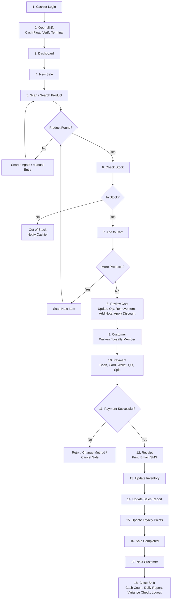

# POS System — User Flow Documentation

> **End-to-End Sales Process**
> This document describes the complete user flow of the Point of Sale (POS) System,
> from cashier login and shift opening to sale completion and shift closing.

---

## Table of Contents

1. [System Overview](#1-system-overview)
2. [User Roles](#2-user-roles)
3. [End-to-End Flow Diagram](#3-end-to-end-flow-diagram)
4. [Phase 1 — Shift Startup (Steps 1–3)](#4-phase-1--shift-startup-steps-13)
5. [Phase 2 — Product Scanning & Cart (Steps 4–8)](#5-phase-2--product-scanning--cart-steps-48)
6. [Phase 3 — Customer & Payment (Steps 9–11)](#6-phase-3--customer--payment-steps-911)
7. [Phase 4 — Post-Sale Processing (Steps 12–16)](#7-phase-4--post-sale-processing-steps-1216)
8. [Phase 5 — Shift Closing (Steps 17–18)](#8-phase-5--shift-closing-steps-1718)
9. [Decision Branches & Exception Flows](#9-decision-branches--exception-flows)
10. [Functional Requirements Checklist](#10-functional-requirements-checklist)
11. [Data Entities](#11-data-entities)
12. [Future Enhancements](#12-future-enhancements)

---

## 1. System Overview

The POS System handles the full in-store sales lifecycle:

- **Shift management** — open shift with cash float, close shift with cash count and variance check
- **Sales transactions** — scan/search products, stock validation, cart, discounts, notes
- **Customer handling** — walk-in customers and loyalty members (search / add new)
- **Payments** — cash, credit/debit card, wallet, QR payment, split payment with retry logic
- **Receipts** — print, email, SMS
- **Back-office updates** — inventory deduction, sales reports, loyalty points
- **Loop** — next customer, repeat sales until shift close

---

## 2. User Roles

| Role | Responsibilities |
|------|------------------|
| **Cashier** | Login, open/close shift, new sale, scan products, manage cart, take payment, issue receipt |
| **Customer (Walk-in)** | No account needed, completes purchase as guest |
| **Customer (Loyalty Member)** | Earns/uses loyalty points, searchable customer record |
| **Manager / Admin** *(implied)* | Reviews daily sales report, variance check, shift audit |

---

## 3. End-to-End Flow Diagram

---

## 4. Phase 1 — Shift Startup (Steps 1–3)

### Step 1. Cashier Login

- Cashier authenticates with username/PIN (or email + password).
- Failed logins show an error; account lockout after repeated failures.
- Successful login routes to shift handling.

### Step 2. Open Shift

- **Cash Float:** cashier enters starting cash amount in the drawer.
- **Verify Terminal:** confirm terminal/printer/card reader are connected and working.
- System records shift start time, cashier ID, terminal ID, and opening float.
- A shift must be open before any sale can be created.

### Step 3. Dashboard

- Landing screen after shift opens.
- Shows shift summary, today's sales snapshot, low-stock alerts, quick actions.
- Entry point to **New Sale**.

---

## 5. Phase 2 — Product Scanning & Cart (Steps 4–8)

### Step 4. New Sale

- Cashier starts a new transaction/cart session.
- System generates a sale/transaction ID.

### Step 5. Scan / Search Product

- Input methods: barcode scanner, product name/SKU search.
- Goes to the **Product Found?** decision.

### Step 6. Check Stock

- Reached when a product is found.
- System looks up real-time inventory for that product/variant.

### Step 7. Add to Cart

- Reached when the item is in stock.
- Item with quantity and price is added to the active cart.
- Goes to the **More Products?** decision:
  - **Yes →** Scan Next Item → loop back to product lookup.
  - **No →** proceed to Review Cart.

### Step 8. Review Cart

Cart review actions:

- [ ] Update quantity
- [ ] Remove item
- [ ] Add note (per item or per sale)
- [ ] Apply discount (per item or whole-cart, % or fixed)

---

## 6. Phase 3 — Customer & Payment (Steps 9–11)

### Step 9. Customer

Two customer types:

1. **Walk-in Customer** — no record needed, checkout as guest.
2. **Loyalty Member:**
   - Search existing customer (name / phone / member ID)
   - Add new customer if not found

### Step 10. Payment

Supported payment methods:

- Cash
- Credit / Debit Card
- Wallet
- QR Payment
- Split Payment (combination of the above, e.g., part cash + part card)

Rules:

- Cash → compute change due.
- Card/Wallet/QR → wait for gateway/terminal confirmation.
- Split → collect each tender until the total is covered.

### Step 11. Payment Successful?

- **Yes →** proceed to Receipt (Step 12).
- **No →** exception handling:
  - Retry the same method
  - Change payment method
  - Cancel sale (voids the transaction, restores reserved stock)

---

## 7. Phase 4 — Post-Sale Processing (Steps 12–16)

### Step 12. Receipt

Receipt delivery options:

- Print receipt (thermal printer)
- Email receipt
- SMS receipt

Receipt must show: store info, transaction ID, date/time, cashier, items + quantities + prices, discounts, tax, payment method(s), totals, change, loyalty points earned.

### Step 13. Update Inventory

- Deduct sold quantities from stock.
- Trigger low-stock / out-of-stock flags as needed.

### Step 14. Update Sales Report

- Transaction is appended to daily sales totals.
- Updates dashboard metrics (gross sales, per-method totals, item counts).

### Step 15. Update Loyalty Points

- If customer is a loyalty member, accrue points per earning rules.
- Record points earned on this transaction.

### Step 16. Sale Completed

- Success confirmation screen.
- Transaction is finalized and locked against further edits.

---

## 8. Phase 5 — Shift Closing (Steps 17–18)

### Step 17. Next Customer

- Returns to New Sale for the next transaction.
- Loop continues until the cashier ends the shift.

### Step 18. Close Shift

Closing procedure:

1. **Cash Count** — count physical cash in drawer.
2. **Daily Report** — system generates shift sales summary.
3. **Variance Check** — compare expected vs. counted cash; record over/short.
4. **Logout** — close shift, log cashier out.

---

## 9. Decision Branches & Exception Flows

| Decision Point | Condition | System Behavior |
|----------------|-----------|-----------------|
| Product Found? — No | Barcode/search has no match | Show "Search Again / Manual Entry", return to Step 5 |
| Product Found? — Yes | Match found | Go to Step 6. Check Stock |
| In Stock? — No | Quantity = 0 / insufficient | Show "Out of Stock — Notify Cashier", item is not added |
| In Stock? — Yes | Stock available | Go to Step 7. Add to Cart |
| More Products? — Yes | More items to scan | "Scan Next Item", loop back to product lookup |
| More Products? — No | Cart complete | Go to Step 8. Review Cart |
| Payment Successful? — No | Declined / failed / timeout | Offer Retry, Change Payment Method, or Cancel Sale |
| Payment Successful? — Yes | Approved / cash tendered | Go to Step 12. Receipt |

---

## 10. Functional Requirements Checklist

### Authentication & Shift
- [ ] Cashier login (username/PIN or email/password)
- [ ] Open shift with cash float + terminal verification
- [ ] Dashboard with shift/daily summary
- [ ] Close shift with cash count, daily report, variance check, logout

### Sales & Cart
- [ ] New sale session with unique transaction ID
- [ ] Scan by barcode + search by name/SKU
- [ ] Manual entry fallback
- [ ] Real-time stock check before add-to-cart
- [ ] Out-of-stock notification
- [ ] Multi-item cart loop (scan next item)
- [ ] Review cart: update qty, remove item, add note, apply discount

### Customer & Loyalty
- [ ] Walk-in (guest) checkout
- [ ] Loyalty member search
- [ ] Add new loyalty customer
- [ ] Loyalty points accrual on completed sales

### Payment
- [ ] Cash (with change computation)
- [ ] Credit / Debit card
- [ ] Wallet
- [ ] QR payment
- [ ] Split payment
- [ ] Payment failure handling: retry / change method / cancel sale

### Receipt & Back-Office
- [ ] Print receipt
- [ ] Email receipt
- [ ] SMS receipt
- [ ] Inventory deduction per sale
- [ ] Sales report update per sale
- [ ] Sale completed confirmation + next customer loop

---

## 11. Data Entities

| Entity | Key Fields |
|--------|-----------|
| `User / Cashier` | id, name, PIN/hash, role, active |
| `Shift` | id, cashierId, terminalId, openedAt, openingFloat, closedAt, closingCash, variance |
| `Product` | id, SKU/barcode, name, price, stockQty |
| `Sale / Transaction` | id, shiftId, cashierId, customerId (nullable), status, subtotal, discount, tax, total |
| `SaleItem` | saleId, productId, qty, unitPrice, discount, note |
| `Customer` | id, name, phone/email, loyaltyPoints |
| `Payment` | saleId, method (cash/card/wallet/QR), amount, reference, status |
| `Receipt` | saleId, channel (print/email/SMS), sentAt |
| `InventoryLog` | productId, saleId, qtyChange, reason |

---

## 12. Future Enhancements

- Returns / refunds / void-after-completion flow
- Discount approvals and manager overrides
- Offline mode with sync queue
- Multi-terminal / multi-store support
- Barcode label printing
- Advanced analytics (top products, peak hours, cashier performance)
- SMS/email provider integrations for receipts and loyalty notifications

---

*Source: POS USER FLOW — End-to-End Sales Process diagram (Steps 1–18).*
