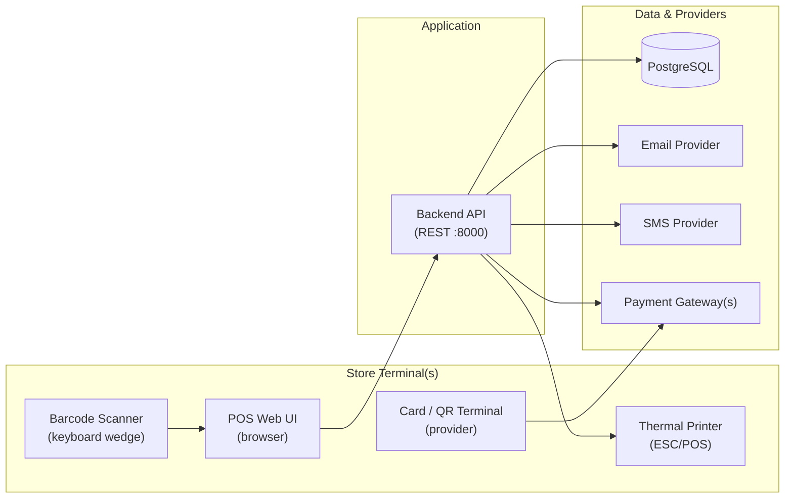
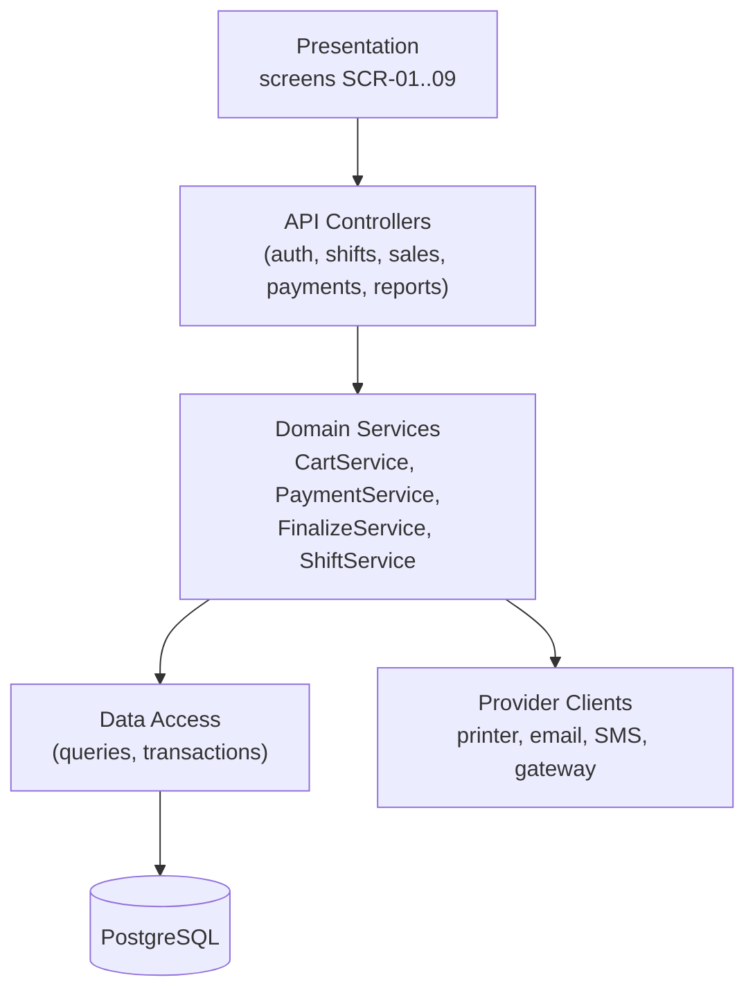
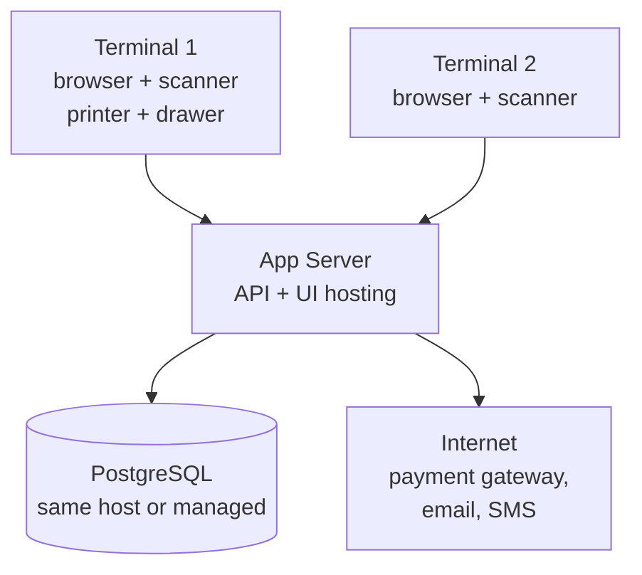

# POS System — Architecture

> System design: components, communication, and the data flow of a sale.
> Related: `README.md` (flow) · `requirement.md` (FRs/NFRs) · `api.md` · `database.md` · `techstack.md`

---

## 1. Big Picture



- **POS Web UI** — single-page selling screen (scan, cart, payment, receipt). Runs on each terminal's browser.
- **Backend API** — one service exposing `api.md` endpoints; owns ALL business rules (stock, totals, payments, finalize). The UI never writes the DB directly.
- **PostgreSQL** — single source of truth (see `database.md`).
- **Providers** — payment gateway(s), email, SMS, and the physical printer are all driven server-side so every attempt is logged.

---

## 2. Logical Layers



Rules:

- Controllers validate input shape; **Services enforce business rules** (BR-01..14).
- Exactly ONE service (`FinalizeService`) may transition a sale to `completed`.
- All money math in one helper (2-decimal, half-up); UI only displays what the API returns.

---

## 3. Data Flow of a Sale (Steps 4–16)

```mermaid
sequenceDiagram
    autonumber
    participant C as Cashier (UI)
    participant A as API
    participant D as PostgreSQL
    participant P as Payment Provider
    participant R as Printer/Email/SMS
    C->>A: POST /sales (New Sale)
    A->>D: INSERT sales (open) + txn_code
    loop Each item
        C->>A: POST /sales/:id/items (scan)
        A->>D: SELECT product FOR UPDATE (stock check)
        A->>D: INSERT sale_items (+ soft reservation)
    end
    C->>A: POST /sales/:id/discounts + /customer
    A->>D: UPDATE totals, attach customer
    C->>A: POST /sales/:id/payments (tender)
    A->>P: charge (card/wallet/QR) or accept (cash)
    P-->>A: approved / declined / expired
    A->>D: INSERT payments (attempt logged)
    C->>A: POST /sales/:id/finalize
    A->>D: BEGIN; lock sale row
    A->>D: deduct stock + inventory_logs
    A->>D: append report aggregates + loyalty points
    A->>D: sale → completed; COMMIT
    A->>R: generate + deliver receipt
    A-->>C: Sale Completed (TxnID, change, points)
```

Key points:

- **Stock check + add** happens inside a row lock (`SELECT … FOR UPDATE`) so two terminals can't sell the last unit (FR-21).
- **Finalize is one DB transaction** — sale + payments + inventory + loyalty commit together or roll back together (FR-58, NFR-10). No half-posted sales.
- **Receipts send AFTER commit** — a failed email/SMS never blocks the sale; the stored copy (`stored` channel) always exists (FR-52).

---

## 4. Deployment Topology (Single Store, v1.0)



- v1.0 is **online-only** (no offline queue) — server + DB reachable from all terminals; internet required for non-cash payments and e-receipts.
- 1 app server handles ~10 terminals (NFR-05); scale vertically first.
- Backups run on the DB host nightly (see `deployment.md`).

---

## 5. Key Design Decisions

| # | Decision | Rationale |
|---|----------|-----------|
| D-01 | Server owns all rules; UI is thin | Prevents tampering + keeps totals/stock consistent |
| D-02 | Soft stock reservations, not hard locks | Cashiers keep selling fast; conflicts resolved at finalize |
| D-03 | Immutable completed sales | Audit-safe; corrections via future returns feature (BR-05) |
| D-04 | Receipts after commit | Delivery failures can't corrupt a sale |
| D-05 | Status TEXT + CHECK (not ENUM) | Easier to extend without migrations |
| D-06 | UTC storage, local display | Correct reports across timezone/DST changes |

---

*Related: `README.md` · `requirement.md` · `api.md` · `database.md` · `deployment.md`.*
