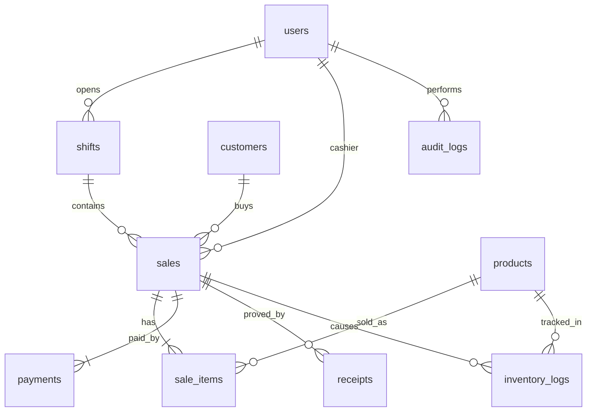

# POS System — Database Documentation (PostgreSQL)

> **DBMS:** PostgreSQL 14+
> **Timezone:** store all timestamps in UTC (`TIMESTAMPTZ`), display in store timezone
> **Money:** `NUMERIC(12,2)`, never negative; rounding half-up in app layer
> Related: `requirement.md` §14 (data requirements) · `README.md` (user flow)

---

## Table of Contents

1. [Entity-Relationship Overview](#1-entity-relationship-overview)
2. [Conventions](#2-conventions)
3. [DDL — Full Schema](#3-ddl--full-schema)
4. [Indexes](#4-indexes)
5. [Seed / Reference Data](#5-seed--reference-data)
6. [Common Queries](#6-common-queries)
7. [Backup & Maintenance](#7-backup--maintenance)

---

## 1. Entity-Relationship Overview



**Cardinality notes:**

- One cashier → many shifts; one shift → many sales.
- Guest sales have `sales.customer_id = NULL`.
- Every completed sale → ≥ 1 receipt row, ≥ 1 payment row, N inventory log rows.

---

## 2. Conventions

- Primary keys: `BIGINT GENERATED ALWAYS AS IDENTITY`.
- Foreign keys: `ON DELETE RESTRICT` (ledger tables are never cascade-deleted).
- Soft delete for master data: `active BOOLEAN DEFAULT TRUE` (users, products, customers).
- Status columns use `TEXT` + `CHECK` constraints (see DDL).
- `created_at TIMESTAMPTZ DEFAULT now()` on every table.
- Transaction code: unique human-readable `txn_code` (e.g., `TXN-20240910-0001`).

---

## 3. DDL — Full Schema

```sql
-- =============================================================
-- POS System schema (PostgreSQL 14+)
-- =============================================================

-- ---------- USERS ----------
CREATE TABLE users (
    id          BIGINT GENERATED ALWAYS AS IDENTITY PRIMARY KEY,
    name        TEXT NOT NULL,
    login       TEXT NOT NULL UNIQUE,          -- username or email
    secret_hash TEXT NOT NULL,                 -- bcrypt/argon2 hash of PIN or password
    role        TEXT NOT NULL DEFAULT 'cashier'
                CHECK (role IN ('cashier', 'manager', 'admin')),
    active      BOOLEAN NOT NULL DEFAULT TRUE,
    created_at  TIMESTAMPTZ NOT NULL DEFAULT now()
);

-- ---------- SHIFTS ----------
CREATE TABLE shifts (
    id            BIGINT GENERATED ALWAYS AS IDENTITY PRIMARY KEY,
    cashier_id    BIGINT NOT NULL REFERENCES users(id) ON DELETE RESTRICT,
    terminal_id   TEXT NOT NULL,               -- e.g., 'TERM-01'
    status        TEXT NOT NULL DEFAULT 'open'
                  CHECK (status IN ('open', 'closed')),
    opened_at     TIMESTAMPTZ NOT NULL DEFAULT now(),
    opening_float NUMERIC(12,2) NOT NULL CHECK (opening_float >= 0),
    closed_at     TIMESTAMPTZ,
    closing_cash  NUMERIC(12,2) CHECK (closing_cash IS NULL OR closing_cash >= 0),
    variance      NUMERIC(12,2),               -- closing_cash - expected_cash
    created_at    TIMESTAMPTZ NOT NULL DEFAULT now(),
    CONSTRAINT one_open_shift_per_cashier_terminal
        EXCLUDE USING btree (cashier_id WITH =, terminal_id WITH =)
        WHERE (status = 'open')
);

-- ---------- PRODUCTS ----------
CREATE TABLE products (
    id            BIGINT GENERATED ALWAYS AS IDENTITY PRIMARY KEY,
    sku           TEXT NOT NULL UNIQUE,        -- internal SKU
    barcode       TEXT UNIQUE,                 -- scan code (nullable if no barcode)
    name          TEXT NOT NULL,
    price         NUMERIC(12,2) NOT NULL CHECK (price >= 0),
    stock_qty     INTEGER NOT NULL DEFAULT 0 CHECK (stock_qty >= 0),
    low_threshold INTEGER NOT NULL DEFAULT 10 CHECK (low_threshold >= 0),
    active        BOOLEAN NOT NULL DEFAULT TRUE,
    created_at    TIMESTAMPTZ NOT NULL DEFAULT now()
);

-- ---------- CUSTOMERS (loyalty members) ----------
CREATE TABLE customers (
    id         BIGINT GENERATED ALWAYS AS IDENTITY PRIMARY KEY,
    name       TEXT NOT NULL,
    phone      TEXT NOT NULL UNIQUE,           -- member lookup key
    email      TEXT,
    points     INTEGER NOT NULL DEFAULT 0 CHECK (points >= 0),
    active     BOOLEAN NOT NULL DEFAULT TRUE,
    created_at TIMESTAMPTZ NOT NULL DEFAULT now()
);

-- ---------- SALES ----------
CREATE TABLE sales (
    id          BIGINT GENERATED ALWAYS AS IDENTITY PRIMARY KEY,
    txn_code    TEXT NOT NULL UNIQUE,          -- e.g., TXN-20240910-0001
    shift_id    BIGINT NOT NULL REFERENCES shifts(id) ON DELETE RESTRICT,
    cashier_id  BIGINT NOT NULL REFERENCES users(id) ON DELETE RESTRICT,
    customer_id BIGINT REFERENCES customers(id) ON DELETE RESTRICT,  -- NULL = walk-in
    status      TEXT NOT NULL DEFAULT 'open'
                CHECK (status IN ('open', 'completed', 'voided')),
    subtotal    NUMERIC(12,2) NOT NULL DEFAULT 0 CHECK (subtotal >= 0),
    discount    NUMERIC(12,2) NOT NULL DEFAULT 0 CHECK (discount >= 0),
    tax         NUMERIC(12,2) NOT NULL DEFAULT 0 CHECK (tax >= 0),
    total       NUMERIC(12,2) NOT NULL DEFAULT 0 CHECK (total >= 0),
    void_reason TEXT,                          -- required when voided
    completed_at TIMESTAMPTZ,
    created_at  TIMESTAMPTZ NOT NULL DEFAULT now()
);

-- ---------- SALE ITEMS ----------
CREATE TABLE sale_items (
    id         BIGINT GENERATED ALWAYS AS IDENTITY PRIMARY KEY,
    sale_id    BIGINT NOT NULL REFERENCES sales(id) ON DELETE RESTRICT,
    product_id BIGINT NOT NULL REFERENCES products(id) ON DELETE RESTRICT,
    qty        INTEGER NOT NULL CHECK (qty >= 1),
    unit_price NUMERIC(12,2) NOT NULL CHECK (unit_price >= 0),  -- price snapshot
    discount   NUMERIC(12,2) NOT NULL DEFAULT 0 CHECK (discount >= 0),
    note       TEXT,
    created_at TIMESTAMPTZ NOT NULL DEFAULT now()
);

-- ---------- PAYMENTS ----------
CREATE TABLE payments (
    id          BIGINT GENERATED ALWAYS AS IDENTITY PRIMARY KEY,
    sale_id     BIGINT NOT NULL REFERENCES sales(id) ON DELETE RESTRICT,
    method      TEXT NOT NULL
                CHECK (method IN ('cash', 'card', 'wallet', 'qr')),
    amount      NUMERIC(12,2) NOT NULL CHECK (amount > 0),
    reference   TEXT,                          -- approval code / provider ref (last-4 only for cards)
    status      TEXT NOT NULL DEFAULT 'pending'
                CHECK (status IN ('pending', 'confirmed', 'failed', 'expired', 'voided')),
    attempted_at TIMESTAMPTZ NOT NULL DEFAULT now()
);

-- ---------- RECEIPTS ----------
CREATE TABLE receipts (
    id          BIGINT GENERATED ALWAYS AS IDENTITY PRIMARY KEY,
    sale_id     BIGINT NOT NULL REFERENCES sales(id) ON DELETE RESTRICT,
    channel     TEXT NOT NULL
                CHECK (channel IN ('print', 'email', 'sms', 'stored')),
    destination TEXT,                          -- email address / phone number (NULL for print/stored)
    status      TEXT NOT NULL DEFAULT 'sent'
                CHECK (status IN ('sent', 'failed')),
    is_reprint  BOOLEAN NOT NULL DEFAULT FALSE,
    sent_at     TIMESTAMPTZ NOT NULL DEFAULT now()
);

-- ---------- INVENTORY LOG (audit trail) ----------
CREATE TABLE inventory_logs (
    id          BIGINT GENERATED ALWAYS AS IDENTITY PRIMARY KEY,
    product_id  BIGINT NOT NULL REFERENCES products(id) ON DELETE RESTRICT,
    sale_id     BIGINT REFERENCES sales(id) ON DELETE RESTRICT,  -- NULL for manual adjustments
    qty_change  INTEGER NOT NULL CHECK (qty_change <> 0),        -- negative = deduction
    reason      TEXT NOT NULL,                 -- 'sale', 'void-release', 'adjustment', ...
    created_at  TIMESTAMPTZ NOT NULL DEFAULT now()
);

-- ---------- AUDIT LOG ----------
CREATE TABLE audit_logs (
    id         BIGINT GENERATED ALWAYS AS IDENTITY PRIMARY KEY,
    actor_id   BIGINT REFERENCES users(id) ON DELETE RESTRICT,
    action     TEXT NOT NULL,                  -- 'login', 'shift.open', 'discount.apply', 'sale.void', ...
    entity_ref TEXT,                           -- e.g., 'sale:123', 'shift:5'
    detail     JSONB,
    created_at TIMESTAMPTZ NOT NULL DEFAULT now()
);
```

---

## 4. Indexes

```sql
-- Fast barcode scan (Step 5) and name/SKU search
CREATE INDEX idx_products_barcode ON products(barcode) WHERE active;
CREATE INDEX idx_products_name_trgm ON products USING gin (name gin_trgm_ops);  -- needs pg_trgm
CREATE INDEX idx_products_sku ON products(sku);

-- Member lookup (Step 9)
CREATE INDEX idx_customers_phone ON customers(phone) WHERE active;
CREATE INDEX idx_customers_name_trgm ON customers USING gin (name gin_trgm_ops); -- needs pg_trgm

-- Shift + sales reporting (Steps 14, 18)
CREATE INDEX idx_sales_shift ON sales(shift_id);
CREATE INDEX idx_sales_status ON sales(status);
CREATE INDEX idx_sales_created ON sales(created_at);
CREATE INDEX idx_payments_sale ON payments(sale_id);
CREATE INDEX idx_items_sale ON sale_items(sale_id);
CREATE INDEX idx_invlog_product ON inventory_logs(product_id);
CREATE INDEX idx_receipts_sale ON receipts(sale_id);
CREATE INDEX idx_audit_actor_time ON audit_logs(actor_id, created_at);

-- Enable trigram extension for fuzzy search (run once)
CREATE EXTENSION IF NOT EXISTS pg_trgm;
```

---

## 5. Seed / Reference Data

```sql
-- Default admin (PIN '1234' hashed with bcrypt — replace before go-live!)
INSERT INTO users (name, login, secret_hash, role)
VALUES ('System Admin', 'admin', '$2b$12$REPLACE_WITH_REAL_HASH', 'admin');

-- Tax / store settings live in app config, not the DB (see requirement.md §13.1).
-- Opening stock is imported from the store's CSV before go-live (rollout P-0).
```

---

## 6. Common Queries

```sql
-- Stock check before add-to-cart (Step 6), with row lock for reservation
SELECT id, name, price, stock_qty
FROM products
WHERE barcode = $1 AND active
FOR UPDATE;

-- Sale totals (verify paidTotal >= total before finalize, BR-03)
SELECT s.total, COALESCE(SUM(p.amount), 0) AS paid
FROM sales s
LEFT JOIN payments p ON p.sale_id = s.id AND p.status = 'confirmed'
WHERE s.id = $1
GROUP BY s.total;

-- Shift summary for close (Step 18)
SELECT
  COUNT(*) FILTER (WHERE status = 'completed') AS txns,
  COALESCE(SUM(total) FILTER (WHERE status = 'completed'), 0) AS gross,
  COALESCE(SUM(total) FILTER (WHERE status = 'voided'), 0) AS voided_total
FROM sales WHERE shift_id = $1;

-- Per-method totals for the shift report
SELECT method, SUM(amount) AS tendered
FROM payments p JOIN sales s ON s.id = p.sale_id
WHERE s.shift_id = $1 AND p.status = 'confirmed'
GROUP BY method;

-- Low / out of stock alerts (Dashboard + REP-06)
SELECT sku, name, stock_qty FROM products
WHERE active AND stock_qty <= low_threshold
ORDER BY stock_qty;

-- Finalize sale atomically (app layer wraps in one transaction):
-- 1) UPDATE sales SET status='completed' ...  2) UPDATE products stock ...
-- 3) INSERT inventory_logs ...  4) UPDATE customers points ...
```

---

## 7. Backup & Maintenance

- **Backups:** `pg_dump` nightly (full) + WAL archiving for point-in-time recovery;
  target RPO ≤ 15 min, RTO ≤ 1 h (see NFR-12).
- **Retention:** transactional rows kept ≥ 3 years; never hard-delete sales/payments.
- **Vacuum:** autovacuum on (defaults fine); run `ANALYZE` after bulk catalog imports.
- **Connection pooling:** use PgBouncer or driver pooling; size for ~10 terminals/store.

```bash
# Example nightly backup
pg_dump -Fc -U pos_user -h localhost posdb > /backups/posdb_$(date +%F).dump
```

---

*Related: `README.md` (user flow) · `requirement.md` (system requirements) · `techstack.md` (stack).*
